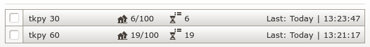

# tkpy
travian kingdom utilities for your need.


[](https://www.python.org/downloads/release/python-367/)

---
### installation
1. install [primordial package](https://github.com/lijok/primordial)
2. git clone [this repo](https://github.com/didadadida93/tkpy.git)
3. change directory to tkpy
4. enjoy
---
### how it work
##### 1. zoo tamer
`python3 zoo_tamer.py dummy@email.com dummypassword com9`

by default zoo tamer will **find crocodile, tiger, and elephant on all unoccupied oasis.** 

if you want to find bear as well, you need to:
* open `zoo_tamer.py` with any text editor
* change the `SOI` value
```python
SOI = {
	'7', '8', '9', '10'
}
```
* save and run it again
> to see the result, check ingame notepad.

---
##### 2. cropper
`python3 cropper.py dummy@email.com dummypassword com9`

it will find all cropper.
> to see the result, check ingame notepad.

---
##### 3. greyer
`python3 greyer.py dummy@email.com dummypassword com9`

by default greyer will **find all grey village and add them to farm list.**
if you want to find spesific village like minimum population and minimum/maximum distance, you need to:
* open `greyer.py` with any text editor
* then change:
	* `MIN_POPULATION` value based on your need
	* `MAX_POPULATION` value based on your need
	* `CENTER` value (coordinate of village where you send a farmlist)
	* `MIN_DISTANCE` value based on your need
	* `MAX_DISTANCE` value based on your need
* save and run it again
> to see the result, check ingame farmlist.

---
##### 4. dodger
`python3 dodger.py dummy@email.com dummypassword com9`

by default dodger will **evade all incoming attack on all your village**. but before you run dodger, you need to:
* open `dodger.py` with any text editor
* then change the `TARGET` value (coordinate of nearest occupied oasis)
* save and run it again

if you just want to cover some village (usually scout village and hammer village), you need to edit `VOI` as well. example:
```python
VOI = ['scout village name', 'hammer village name']
TARGET = -13, 13
```

---
##### 5. chickener
`python3 chickener.py dummy@email.com dummypassword com9`

by default chickener will **find all player who use chicken boot** and mark their village with purple flag.

> _advise:_ size down the area when you use this feature, cause it find all player within the map who use chicken boot _synchronously_ (read: slow work)

for find player within spesific area, you need to:
* open `chickener.py` with any text editor
* then change:
	* `CENTER` value (coordinate of center area that you want to find)
	* `RADIUS` value based on your need
* save and run it again
> to see the result, check ingame map.

---
##### 6. save resources
`python3 save_resources.py dummy@email.com dummypassword com9`

by default save resources will **save all resources to marketplace on all your village**.
if you want to cover some village (usually resources village), you need to edit `VOI` value. example:
```python
VOI = ['resources village 1', 'resources village 2', 'and so on..']
```

---
##### 7. run farmlist
`python3 run_farmlist.py dummy@email.com dummypassword com9`

**this feature still in early stage.** it will automatically send farmlist every given time in minute.
before you run this feature you need to rename your farmlist that want to run automatically. the name should follow this rule:
`tkpy <minute>`

example:


---
### postscript

you have an idea? or found a bug? wanna contribute to project? open an issue and make a PR.
it is open project after all :wink:

---
_we love lowercase_
